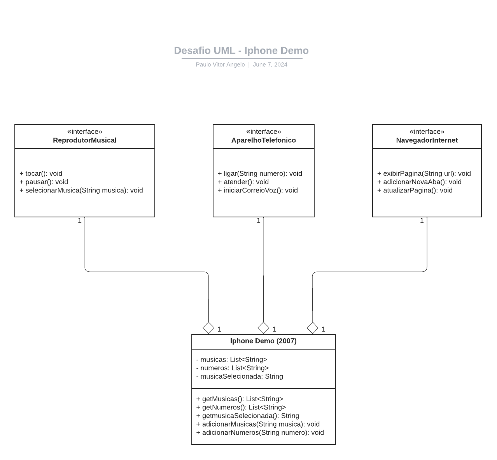

# Desafio UML DIO - Bootcamp: Santander 2024 - Backend com Java

Bem-vindo ao meu repositório do desafio proposto pela DIO como parte da formação do bootcamp Santander 2024 - Backend com Java. Leia este ReadMe para entender o que foi proposto e como desenvolvi a solução:

## Objetivo do Desafio

O objetivo do desafio era criar um diagrama UML para representar o primeiro iPhone, inspirado na [apresentação de lançamento do Iphone em 2007](https://youtu.be/9ou608QQRq8?si=wI4xkRIU6H0xrzNu). Além do diagrama, os alunos também tinham a opção de implementar as classes em Java. Por isso, neste repositório você encontrará no diretório `src/` os arquivos `.java` que desenvolvi para representar as classes do diagrama, além de uma classe `Main.java` que simula a apresentação do vídeo citado acima.

### O diagrama deveria incluir as classes abaixo e como elas seriam utilizadas para criar o Iphone:

1. **Reprodutor Musical**
   - Métodos: `tocar()`, `pausar()`, `selecionarMusica(String musica)`

2. **Aparelho Telefônico**
   - Métodos: `ligar(String numero)`, `atender()`, `iniciarCorreioVoz()`

3. **Navegador na Internet**
   - Métodos: `exibirPagina(String url)`, `adicionarNovaAba()`, `atualizarPagina()`

Para representar estas classes eu optei por torná-las interfaces que seriam implementadas na classe Iphone. O diagrama está abaixo e também pode ser encontrada no diretório `/uml` em formato `.png` e `.pdf`:

## Diagrama UML

